# F1C100s_with_Keil_RTX4_emWin5
F1C100s with Keil RTX4 + emWin5

# 项目简介
全志F1C100s/F1C200s是极具性价比的ARM9芯片，采用ARM926EJ-S内核，片内自带32MB/64MB SIP-DDR1，DDR频率可稳定运行在156Mhz，CPU主频可达720Mhz无故障运行。这些芯片被广泛用于消费/娱乐电子设备中，系统采用定制化的嵌入式Linux。如今这款芯片市场价大约10元RMB，极具性价比！高性价比吸引了大量单片机开发者，但是单片机开发者通常缺乏Linux开发经验，而且对具备MMU+Cache的ARM9也不够熟悉，因而无法快速上手这几款SoC。于是，这个项目的诞生就是为广大单片机开发者降低门槛，让你打开熟悉的Keil就有可用的RTOS【RTX4】和GUI【emWin】！（Keil环境为ARM公司版权所有）项目直接支持的开发板有：

* widora的tiny200 v1
* widora的tiny200 v2
* sipeed的lichee-pi nano

# 项目增强
由于以上三款开发板没有引出jtag接口，所以开发过程使用sunxi-fel通过USB把程序镜像写入spiflash或者DDR运行就是最快捷的方式。而此开源版本没有FEL写入DDR的支持，这个功能作为扩展功能不作开源。如果你需要这个功能，可以扫描下面的alipay二维码，给作者打赏然后通过QQ联系作者，作者会把支持FEL功能的项目包发到你给定的邮箱。

# 作者QQ：26750452

# 推荐
推荐使用widora的tiny200开发板，板子为单片机开发者设计了boot和reset按钮，因而进入FEL模式非常方便！板子还自带USB转串口芯片，可作为终端串口，方便调试信息输出。

# 图赏
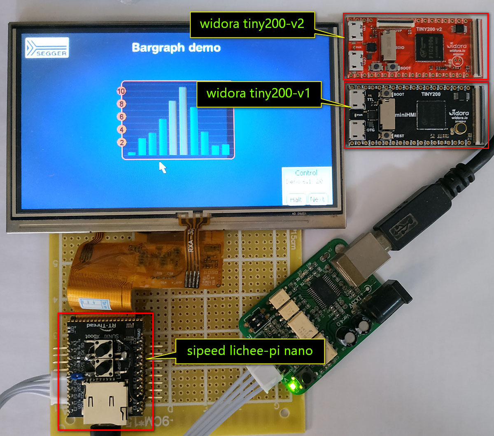
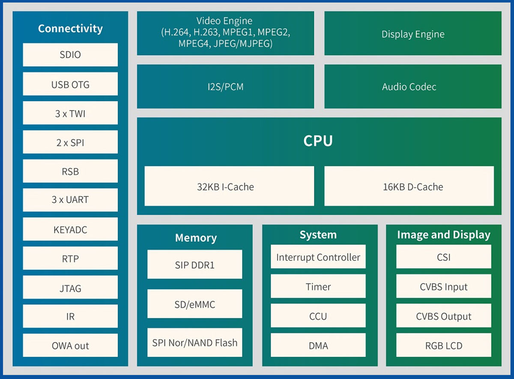
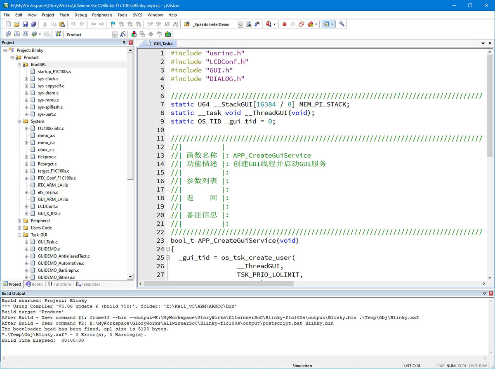
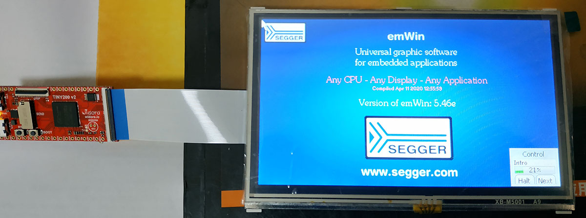
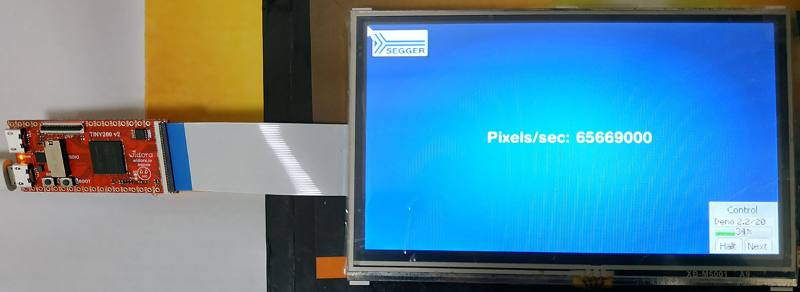
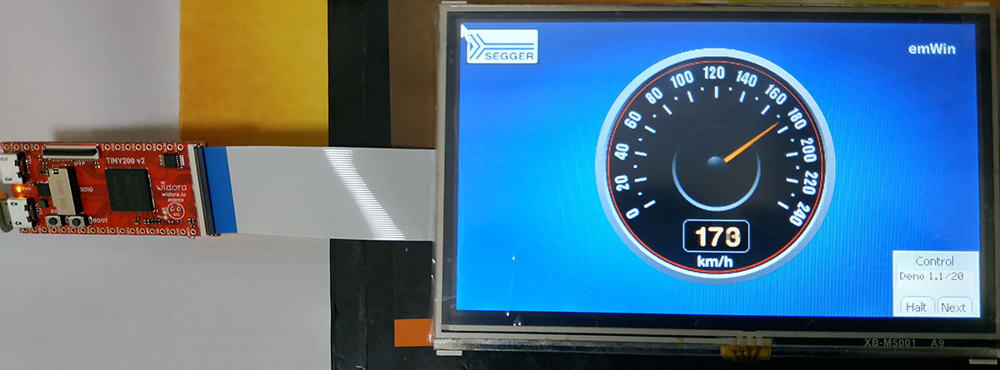
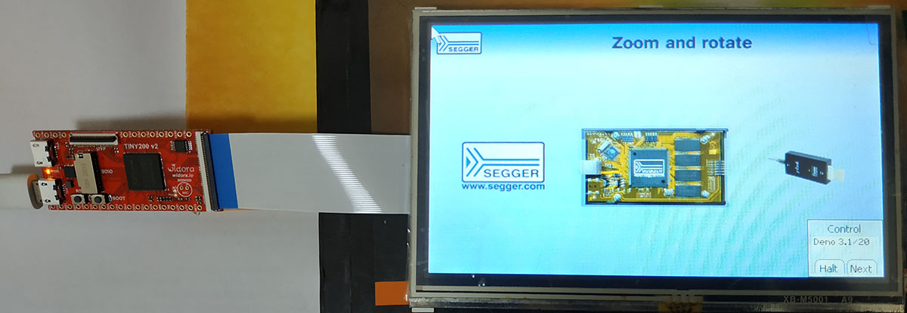
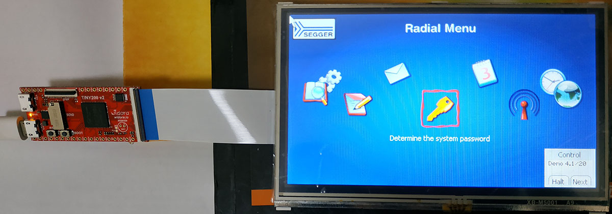
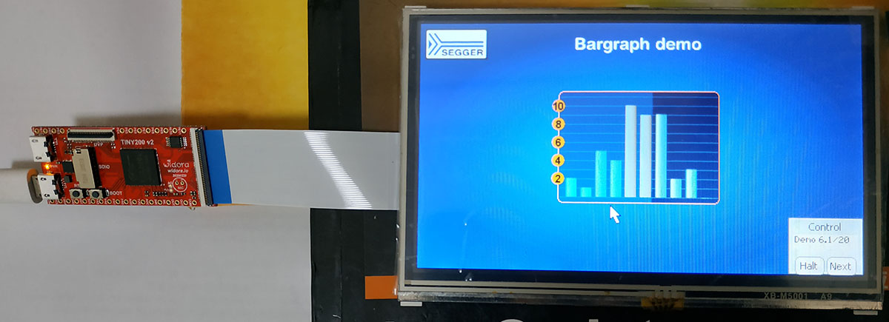
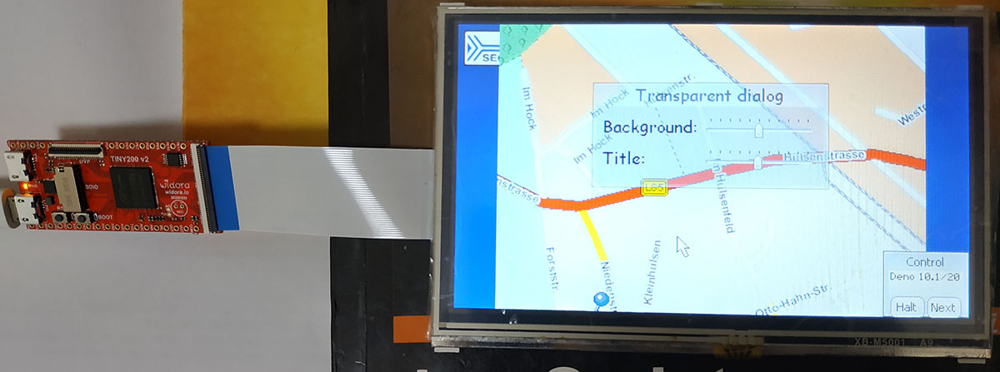
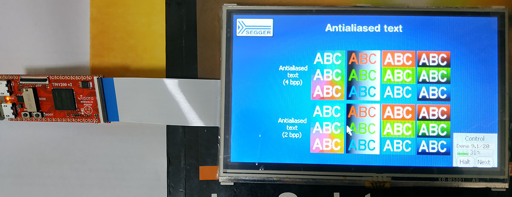

# 打赏

